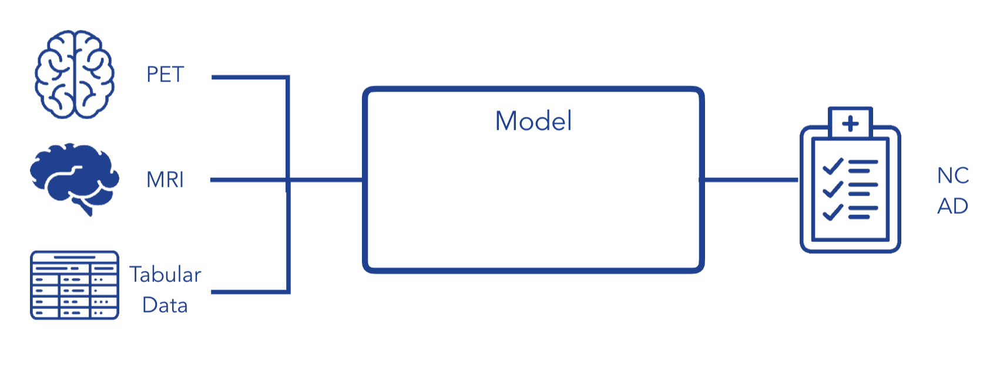
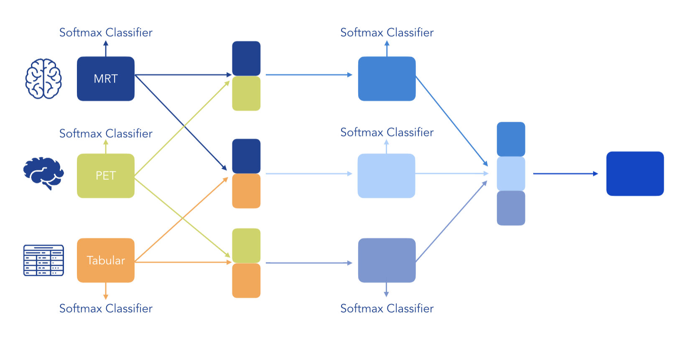
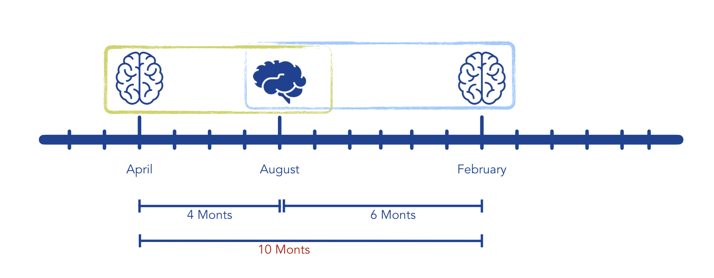
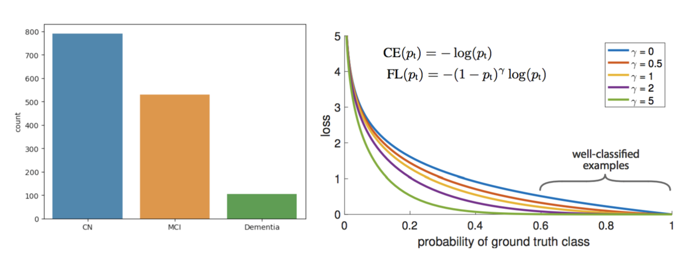
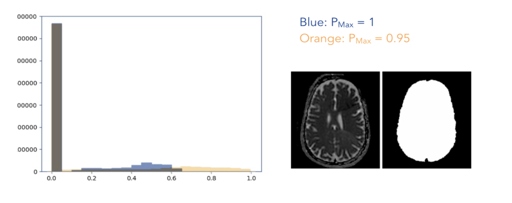
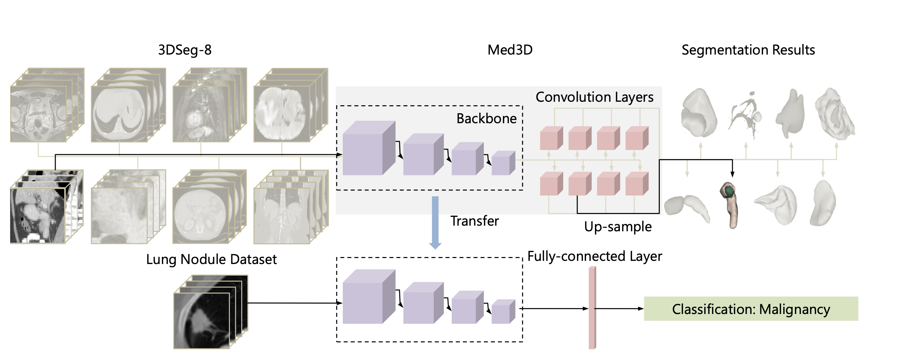
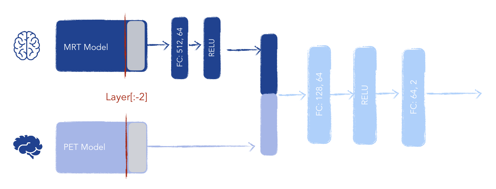
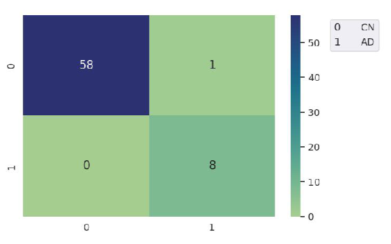
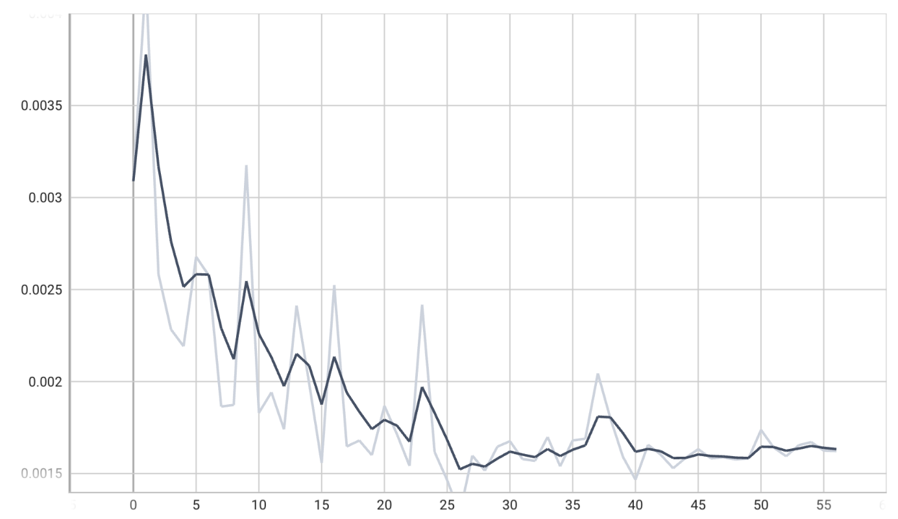

# ADLM ADNI

ADNI is a rich dataset designed to track Alzheimers and potential Alzheimers patients across the US. 3D Brain MRI scans as well as protein-indicating PET scans are used to measure the biological state of the patient in addition to genetic testing, general demographic information, blood biomarkers and cognitive tests.

Much research focuses on creating the best possible model with only one source of data, often leaving a lot of useful information unnecessarily on the table. With so much information from many different sources available, we are interested in investigating how best to combine these pools of information to achieve the best possible classification of Alzheimers disease state. Focus will be on how to optimally combine different modalities, taking care not to encode the same information multiple times while allowing correlations and interactions between data sources to be learned.

## General task overview


## Fusion Model
### 3 Stage Model
Our 3-stage model is inspired by the following [paper](https://pubmed.ncbi.nlm.nih.gov/30381863/).


## Multi-modal Dataset Class
In our multi-modal dataloader, we try to use our data as efficiently as possible. This means that a sample fed into a single-modal model can be used to create multiple samples for a multi-modal model.


## Data Imbalance
We can observe that the AD class in underrepresented in the ADNI dataset. In order to tackle this imbalance during trainig we apply two different approaches:
- use a weighted CE loss function
- use the [Focal Loss](https://github.com/clcarwin/focal_loss_pytorch) function

## Data Pre-processing
### MRI
Data normalization is performed:
- per-scan
- min-max between 0 and 1
- data is mapped to 0 and 1 boundaries based on quantiles


### PET
Data normalization is performed by standardization based on the statistics of the entire training split.

## Models

### MedicalNet
For our baseline MRI model we make use of pre-trained ResNet architectures that have been trained 3D medical image data. The implementation of MedicalNet can be found [here](https://github.com/Tencent/MedicalNet) and for the original paper click [here](https://arxiv.org/pdf/1904.00625.pdf).

The authors:
- aggregated a dataset from several medical challenges (3DSeg-8 dataset)
- extract general medical 3D features with Med3D to co-train multi-domain 3DSeg-8 so as to make a series of pre-trained models. 
- transfer Med3D pre-trained models to lung segmentation, pulmonary nodule classification, etc.



### Fusion PET-MRI

 

# Setup

## Environment
Install the project environment with
```
conda env create -f environment.yml
```
afterwards you will be able to use it with
```
conda activate adni
```

If you install new stuff and want to commit code that requires it, update the environment with
```
conda env export -f environment.yml --no-builds
```

## MedicalNet
A copy of MedicalNet including all pretrained models is stored in the shared project folder under
`/vol/chameleon/projects/adni/adni_1/MedicalNet`. If you want to execute code depending on 
MedicalNet add 
```
export PYTHONPATH="${PYTHONPATH}:/vol/chameleon/projects/adni/adni_1/"
```
to your `~/.bashrc` (or other shell configuration).
Log out and log in again in order to make changes take effect.
You can test the configuration with
```
python -c "import sys; print(sys.path)"
```
The output should contain `/vol/chameleon/projects/adni/adni_1/`.
You can then just use it like any normal module with
```
from MedicalNet import ...
```

**Important: Do not change code in the MedicalNet repository!** If you need to do stuff differently
than them, create a new file in our repository and load the modules you need.

## Automatic ssh authentification for download script usage
Add to your ssh config (~/.ssh/config):
```
Host adlm 
  HostName 131.159.110.3 
  User <YOUR_USERNAME>
```

Connect to the AIMED VPN.
Add your public key to authkeys on the server:
```
you@your_computer:~$ ssh-copy-id -i ~/.ssh/<YOUR_PUBLIC_KEY_FILE> adlm
```

Now you can login with 
```
ssh adlm
``` 
if you are connected to the VPN and use the download script for tabular data.

# Usage

After setting up automatic ssh authentification you can download tabular data by running 
```
./download_tabular.sh
```

Run any (python-)scripts from the project root directory, otherwise you will get errors
due to wrong path configuration.

Make sure to delete cell outputs in jupyter notebooks before staging/committing.

## Project setup
- Set up path_config.yaml with paths to model checkpoints
- Generate train/val/test path indices (csv files containing path to data and labels) with `python pkg/utils/create_csv/data_labels.py`

## Training
Run `python pkg/models/<model_group>/train_<model>.py`. Results are logged to `lightning_logs` and can be visualized with tensorboard.

## Testing
Run `python inference/test_<model>.py` or `python inference/run_all_tests.sh`. Results are logged to `lightning_logs` and can be visualized with tensorboard.
